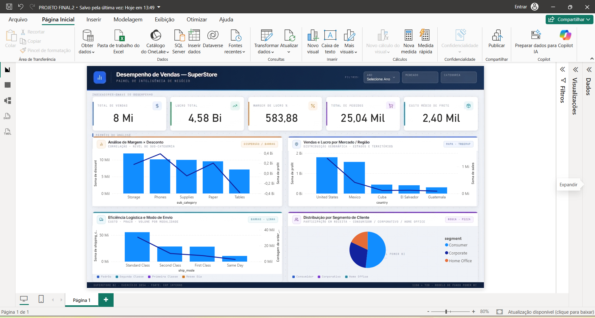

# 📊 Dashboard de Desempenho de Vendas — SuperStore

Este repositório contém o projeto de Business Intelligence desenvolvido no **Power BI**, utilizando um layout moderno e funcional criado no **Figma** para otimizar a experiência do usuário (UX/UI).

---

## 📷 Visão Geral do Painel

*(Lembre-se de subir a foto do seu dashboard para o repositório com o nome exacto `dashboard.png`)*

---

## 🎯 Objetivos do Projeto

O painel foi desenvolvido para responder a perguntas estratégicas do negócio, tais como:
- Qual o faturamento total e a lucratividade da empresa?
- Quais regiões e mercados possuem o maior volume de vendas e margem?
- Como o desconto concedido afeta o lucro dos produtos?
- Qual a eficiência logística e o custo médio de frete por modo de envio?

---

## 🧠 Estrutura de Dados e Modelagem

- **Modelagem:** Estrutura Star Schema (Tabela Fato e Tabelas Dimensão).
- **Tabela Fato:** `FATO_VENDA`
- **Tabelas Dimensão:** `DIM_CLIENTE`, `DIM_PRODUTO`, `DIM_LOCALIDADE` e `DIM_CALENDARIO`.

---

## 📌 Principais Indicadores (KPIs) e Métricas

- **Total de Vendas:** Soma do faturamento bruto (`sales`).
- **Lucro Total:** Resultado financeiro líquido (`profit`).
- **Margem de Lucro (%):** Razão entre o lucro acumulado e o volume total de vendas.
- **Total de Pedidos:** Contagem distinta de transações (`order_id`).
- **Custo Médio de Frete:** Média dos custos de envio por modalidade (`shipping_cost`).

---

## 🛠️ Tecnologias Utilizadas

- **Power BI Desktop:** ETL, Modelagem de Dados, DAX e Construção dos Visuais.
- **Figma:** Prototipagem de UI/UX e design do background.
- **Git & GitHub:** Versionamento e publicação do portfólio.

---

## 📂 Como visualizar o projeto

1. Faça o download do arquivo `.pbix` deste repositório.
2. Abra o arquivo no **Power BI Desktop**.
3. Interaja com os visuais e filtros de Ano, Mercado e Categoria!
